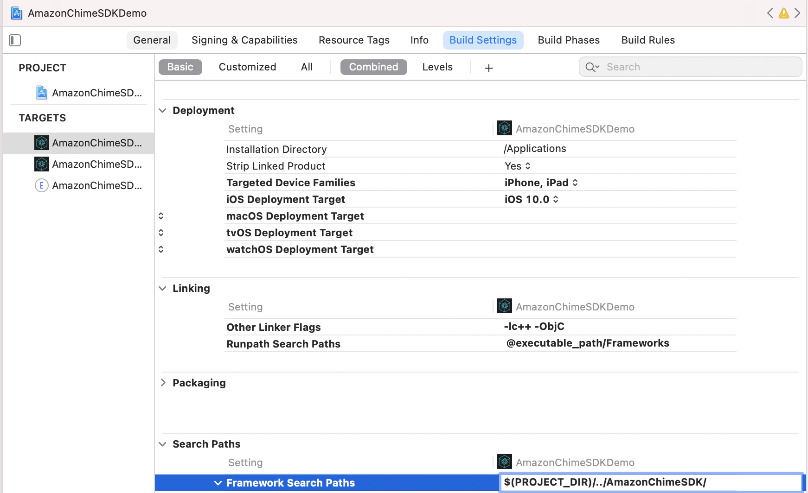
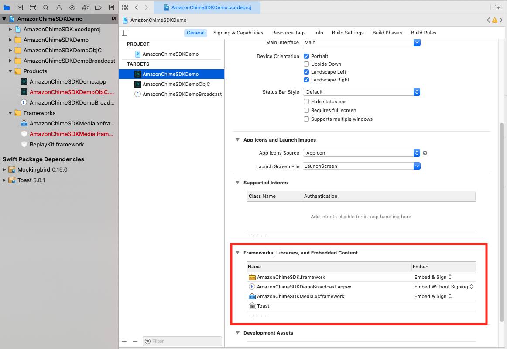
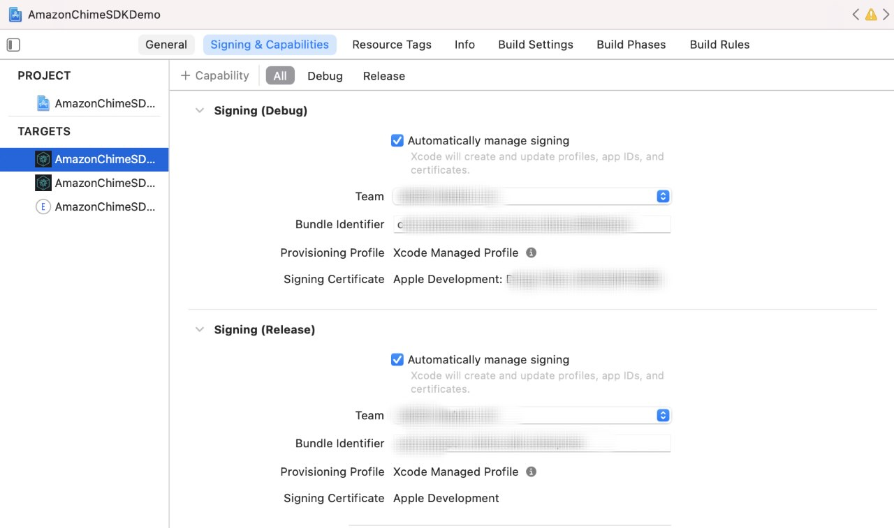
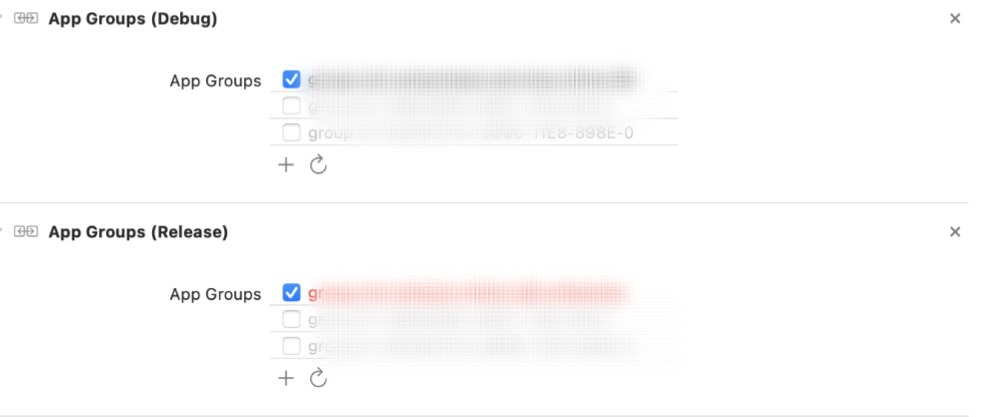

# Amazon Chime SDK for iOS
[Amazon Chime SDK Project Board](https://aws.github.io/amazon-chime-sdk-js/modules/projectboard.html)

> Note: If building with the SDK source code, the `development` branch contains bleeding-edge changes that may not build with the publically available Chime media library or may not be as stable as [public releases](https://github.com/aws/amazon-chime-sdk-ios/releases).

## Build video calling, audio calling, and screen sharing applications powered by Amazon Chime.

The Amazon Chime SDK for iOS makes it easy to add collaborative audio calling,
video calling, and screen share viewing features to iOS applications by
using the same infrastructure services that power meetings on the Amazon
Chime service.

This Amazon Chime SDK for iOS works by connecting to meeting session
resources that you have created in your AWS account. The SDK has everything
you need to build custom calling and collaboration experiences in your
iOS application, including methods to: configure meeting sessions, list
and select audio devices, switch video devices, start and stop screen share
viewing, receive callbacks when media events occur such as volume changes,
and manage meeting features such as audio mute and video tile bindings.

We also have an [Amazon Chime SDK Project Board](https://aws.github.io/amazon-chime-sdk-js/modules/projectboard.html) where you can find community requests and their statuses.

To get started, see the following resources:

* [Amazon Chime](https://aws.amazon.com/chime)
* [Amazon Chime Developer Guide](https://docs.aws.amazon.com/chime/latest/dg/what-is-chime.html)
* [Amazon Chime SDK API Reference](http://docs.aws.amazon.com/chime/latest/APIReference/Welcome.html)
* [SDK Documentation](https://aws.github.io/amazon-chime-sdk-ios/)

And review the following guides:
* [API Overview](guides/api_overview.md)
* [Getting Started](guides/getting_started.md)
* [Frequently Asked Questions (FAQ)](#frequently-asked-questions)
* [Custom Video Sources, Processors, and Sinks](guides/custom_video.md)
* [Video Pagination with Active Speaker-Based Policy](guides/video_pagination.md)
* [Content Share](guides/content_share.md)
* [Meeting Events](guides/meeting_events.md)
* [Event Ingestion](guides/event_ingestion.md)
* [Configuring Remote Video Subscription](guides/configuring_remote_video_subscriptions.md)

## Include Amazon Chime SDK in Your Project
You can integrate Amazon Chime SDK in your project from either CocoaPods or binaries through Github release.

### From CocoaPods
1. The Amazon Chime SDK is available through [CocoaPods](http://cocoapods.org/). If you have not installed CocoaPods, install CocoaPods by running the command:
    ```
    $ gem install cocoapods
    $ pod setup
    ```
    Depending on your system settings, you may have to use sudo for installing cocoapods as follows:

    ```
    $ sudo gem install cocoapods
    $ pod setup
    ```
2. In `AmazonChimeSDKDemo/` directory (the directory where your *.xcodeproj file is), run the following to create a Podfile in your project:
    ```
    $ pod init
    ```
3. Edit the `Podfile` to include `AmazonChimeSDK-Bitcode` into your project if you need bitcode:
    ```
    target 'YourTarget' do
        pod 'AmazonChimeSDK-Bitcode'
        ...
    end
    ```
    If you don't need bitcode, you can add `AmazonChimeSDK-No-Bitcode` instead:
    ```
    target 'YourTarget' do
        pod `AmazonChimeSDK-No-Bitcode`
        ...
    end
    ```
4. Then run the following command to installl pods:
   ```
   $ pod install --repo-update
   ```
5. To open your project, open the newly generated `*.xcworkspace` file in `AmazonChimeSDKDemo/` with XCode. You can do this by issuing the following command in your project folder
   ```
    $ xed .
   ```
   Note: Do *NOT* use *.xcodeproj to open project.

### From Github Release Binaries

For the purpose of setup, your project's root folder (where you can find your `.xcodeproj` file) will be referred to as `root`.

#### 1. Download Binaries

* Download the `AmazonChimeSDK` and `AmazonChimeSDKMedia` binaries from the latest [release](https://github.com/aws/amazon-chime-sdk-ios/releases/latest).

* Unzip and copy the `.framework`s or `.xcframework`s to `root`, which depends on which framework your project uses.  For Xcode12.3 and later, please use `.xcframework` if you have compile issue. `.xcframework` is available after Amazon Chime SDK iOS v0.15.0

#### 2. Update Project File

* Open your `.xcodeproj` file in Xcode and click on your build target.

* Under `Build Settings` tab,

  * add `$(PROJECT_DIR)` to `Framework Search Path`.
  * add `@executable_path/Frameworks` to `Runpath Search Paths`.

  * under `Linking` section, add the following two flags in `Other Linker Flags`:
    * `-lc++`
    * `-ObjC`

<p align="center">

</p>

* Under `General` tab, look for `Frameworks, Libraries, and Embedded Content` section. Click on +, then `Add Others`, then `Add Files`.

  * If you are using traditional `.framework`, specify the location of `AmazonChimeSDK.framework` and `AmazonChimeSDKMedia.framework` from Step 1. If you have compile error while using traditional `.framework`, which occurs in Xcode 12.3 and later, please use `.xcframework` instead, which is available after Amazon Chime SDK iOS v0.15.0.
  * If you are using `.xcframework`, specify the location of `AmazonChimeSDK.xcframework` and `AmazonChimeSDKMedia.xcframework` from Step 1.
  * For these two frameworks, verify that `Embed & Sign` is selected under the `Embed` option.

<p align="center">

</p>

## Running the Demo App

To run the demo application, follow these steps.

### 1. Clone the Git Repo

`git clone git@github.com:aws/amazon-chime-sdk-ios.git`

### 2. Import Amazon Chime SDK
#### From CocoaPods
For both targets in `/AmazonChimeSDKDemo/Podfile`, replace `AMAZON_CHIME_SDK_VERSION` with a specific SDK version, e.g. `0.19.3` or remove it if utilize the latest version of Amazon Chime SDK.

Under `/AmazonChimeSDKDemo`, run the following command to install pods:
```
$ pod install --repo-update
```

#### Or From Downloaded Binary
* Download `AmazonChimeSDKMedia` binary with bitcode support from the latest [release](https://github.com/aws/amazon-chime-sdk-ios/releases/latest).

* Unzip and copy the `AmazonChimeSDKMedia.framework` to `AmazonChimeSDK` folder.

### 3. Deploy Serverless Demo

Deploy the serverless demo from [amazon-chime-sdk-js](https://github.com/aws/amazon-chime-sdk-js)

### 4. Update AmazonChimeSDKDemo Project File

* If set up the demo application using `.framework`, please skip the below 4 steps. If encounter compile error when using traditional `.framework`, which occurs in Xcode 12.3 and later, please use `.xcframework` instead.

  * Replace `AmazonChimeSDKMedia.framework` with `AmazonChimeSDKMedia.xcframework` under `root/AmazonChimeSDK` folder,  which is available after Amazon Chime SDK iOS v0.15.0.
  * *For each target*, under `General` tab, look for `Frameworks, Libraries, and Embedded Content` section. Select `AmazonChimeSDKMedia.framework` and click `-` to remove it.
  * Then click `+`, click `Add Other` drop-down list, then `Add Files`.
  * Specify the location of `AmazonChimeSDKMedia.xcframework` and verify that `Embed & Sign` is selected under the `Embed` option.


* `AmazonChimeDemoSDKBroadcast.appex` is a Broadcast Extension for device level screen sharing used by AmazonChimeSDKDemo, verify that `Embed without Signing` is selected under the `Embed` option. Remove it from `Frameworks, Libraries, and Embedded Content` section if you do not wish to test this.

<p align="center">

</p>

* For each target, under `Signing & Capabilities` tab,
  
  * `Signing` section, use your own Apple Developer team and Bundle Identifier.
  * (Optional)`App Groups` section, select your own app groups if you wish to test sharing device level screen capture. See [Content Share](https://github.com/aws/amazon-chime-sdk-ios/blob/master/guides/content_share.md) for more details.

<p align="center">


</p>

### 5. Update Demo App

* Update server URL and region:

  * For Swift demo, update `AppConfiguration.swift` with the server URL and region of the serverless demo.
  * For ObjC demo, update `ViewControllerObjC.h` with the server URL and region of the serverless demo.

* (Optional) Update `broadcastBundleId` and `appGroupId` in BOTH `AppConfiguration.swift` and `SampleHandler.swift` with the broadcast upload extension bundle ID and App Group ID if you want to test sharing device level screen capture. See [Content Share](https://github.com/aws/amazon-chime-sdk-ios/blob/master/guides/content_share.md) for more details.

### 6. Use Demo App to Join Meeting
#### Run the AmazonChimeSDKDemoPods target with Amazon Chime SDK from CocoaPods
After opening `*.xcworkspace` file in `AmazonChimeSDKDemo/` with XCode, select the `AmazonChimeSDKDemoPods` from the scheme dropdown list in the top bar of Xcode IDE, choose a build device and click the run button.

#### Run the AmazonChimeSDKDemo target with Downloaded Amazon Chime SDK Binaries
After opening `*.xcworkspace` file in `AmazonChimeSDKDemo/` with XCode, select the `AmazonChimeSDKDemo` from the scheme dropdown list in the top bar of Xcode IDE, choose a build device and click the run button.

On the joining screen, choose to join the meeting without `CallKit` or join via `CallKit` incoming/outgoing call. Since the demo app does not have Push Notification, it delays joining via incoming call by 10 seconds to give user enough time to background the app or lock the screen to mimic the behavior.

## Reporting a Suspected Vulnerability

If you discover a potential security issue in this project we ask that you notify AWS/Amazon Security via our
[vulnerability reporting page](http://aws.amazon.com/security/vulnerability-reporting/). Please do **not** create a public GitHub issue.

## Usage
- [Starting a session](#starting-a-session)
- [Device](#device)
- [Audio](#audio)
- [Video](#video)
- [Screen and content share](#screen-and-content-share)
- [Metrics](#metrics)
- [Data Message](#data-message)
- [Stopping a session](#stopping-a-session)
- [Amazon Voice Focus](#amazon-voice-focus)
- [Custom Video Source](#custom-video-source)

### Starting a session

#### Use case 1. Start a session.

You need to start the meeting session to start sending and receiving audio. Make sure that the user has granted audio permission first.

```swift
meetingSession.audioVideo.start()
```

The default audio format is Stereo/48KHz i.e Stereo Audio with 48KHz sampling rate (stereo48K). Other supported audio formats include Mono/48KHz (mono48K) or Mono/16KHz (mono16K). You can specify a non-default audio mode in `AudioVideoConfiguration`, and then start the meeting session.

```swift
var audioVideoConfig = AudioVideoConfiguration()
meetingSession.audioVideo.start(audioVideoConfiguration: audioVideoConfig)
```

#### Use case 2. Add an observer to receive audio and video session life cycle events.

> Note: To avoid missing any events, add an observer before the session starts. You can remove the observer by calling meetingSession.audioVideo.removeAudioVideoObserver(observer).

```swift
class MyAudioVideoObserver: AudioVideoObserver {
    func audioSessionDidStartConnecting(reconnecting: Bool) {
        if (reconnecting) {
            // e.g. the network connection is dropped.
        }
    }
    func audioSessionDidStart(reconnecting: Bool) {
        // Meeting session starts.
        // Can use realtime, devices APIs.
    }
    func audioSessionDidDrop() {}
    func audioSessionDidStopWithStatus(sessionStatus: MeetingSessionStatus) {
         // See the "Stopping a session" section for details.
    }
    func audioSessionDidCancelReconnect() {}
    func connectionDidRecover() {}
    func connectionDidBecomePoor() {}
    func videoSessionDidStartConnecting() {}
    func videoSessionDidStartWithStatus(sessionStatus: MeetingSessionStatus) {
        // Video session starts.
        // Can use video APIs.
    }
    func videoSessionDidStopWithStatus(sessionStatus: MeetingSessionStatus) {}

    meetingSession.audioVideo.addAudioVideoObserver(observer: self)
}
```

### Device

#### Use case 3. List audio devices.

List available audio devices for the meeting.

```swift
// An list of MediaDevice objects
let audioDevices = meetingSession.audioVideo.listAudioDevices()

for device in audioDevices {
    logger.info(msg: "Device type: \(device.type), label: \(device.label)")
}
```

#### Use case 4. Choose audio device by passing `MediaDevice` object.

> Note: You should call this after the session started or it’ll be no-op. You should call chooseAudioDevice with one of devices returned from listAudioDevices().

```swift
let audioDevices = audioVideo.listAudioDevices()
val device = /* An item from audioDevices */
meetingSession.audioVideo.chooseAudioDevice(mediaDevice: device)           
```

#### Use case 5. Switch between camera.

> Note: switchCamera() is no-op if you are using custom camera capture source. Please refer to [Custom Video](https://github.com/aws/amazon-chime-sdk-ios/blob/master/guides/custom_video.md#implementing-a-custom-video-source-and-transmitting) for more details.


Switch to use front or back camera on the device, if available.

```swift
meetingSession.audioVideo.switchCamera()
```

#### Use case 6. Add an observer to receive the updated device list.

Add a `DeviceChangeObserver` to receive a callback when a new audio device connects or when an audio device disconnects. `audioDeviceDidChange` includes an updated device list.

```swift
class MyDeviceChangeObserver: DeviceChangeObserver {
    func audioDeviceDidChange(freshAudioDeviceList: [MediaDevice]) {
        // A list of updated MediaDevice objects
        for device in freshAudioDeviceList {
            logger.info(msg: "Device type: \(device.type), label: \(device.label)")
        }    
    }

    meetingSession.audioVideo.addDeviceChangeObserver(observer: self)
}
```

#### Use case 7. Get currently selected audio device.

```swift
let activeAudioDevice = meetingSession.audioVideo.getActiveAudioDevice()
```

### Audio

#### Use case 8. Choose the audio configuration.

> When joining a meeting, *Mono/16KHz*, *Mono/48KHz* and *Stereo/48KHz* are supported. *Stereo/48KHz* will be set as the default audio mode if not explicitly specified when starting the audio session.

```swift
meetingSession.audioVideo.start() // starts the audio video session with Stereo/48KHz audio and callkit disabled

meetingSession.audioVideo.start(audioVideoConfiguration) // starts the audio video session with the specified [AudioVideoConfiguration]
```

> Note: So far, you've added observers to receive device and session lifecycle events. In the following use cases, you'll use the real-time API methods to send and receive volume indicators and control mute state.

#### Use case 9. Mute and unmute an audio input.

```swift
let muted = meetingSession.audioVideo.realtimeLocalMute() // returns true if muted, false if failed

let unmuted = meetingSession.audioVideo.realtimeLocalUnmute // returns true if unmuted, false if failed
```

#### Use case 10. Add an observer to observe realtime events such as volume changes/signal change/muted status of a specific attendee.

You can use this to build real-time indicators UI and get them updated for changes delivered by the array.

> Note: These callbacks will only include the delta from the previous callback.

```swift
class MyRealtimeObserver: RealtimeObserver {
    func volumeDidChange(volumeUpdates: [VolumeUpdate]) {
        for currentVolumeUpdate in volumeUpdates {
            // Muted, NotSpeaking, Low, Medium, High
            logger.info(msg: "\(currentVolumeUpdate.attendeeInfo.attendeeId)'s volume changed: \(currentVolumeUpdate.volumeLevel)")
        }
    }
    func signalStrengthDidChange(signalUpdates: [SignalUpdate]) {
        for currentSignalUpdate in signalUpdates {
            // None, Low, High
            logger.info(msg: "\(currentSignalUpdate.attendeeInfo.attendeeId)'s signal strength changed: \(currentSignalUpdate.signalStrength)")
        }
    }
    func attendeesDidJoin(attendeeInfo: [AttendeeInfo]) {
        for currentAttendeeInfo in attendeeInfo {
            logger.info(msg: "\(currentAttendeeInfo.attendeeId) joined the meeting")
        }
    }
    func attendeesDidLeave(attendeeInfo: [AttendeeInfo]) {
        for currentAttendeeInfo in attendeeInfo {
            logger.info(msg: "\(currentAttendeeInfo.attendeeId) left the meeting")
        }
    }
    func attendeesDidDrop(attendeeInfo: [AttendeeInfo]) {
        for currentAttendeeInfo in attendeeInfo {
            logger.info(msg: "\(currentAttendeeInfo.attendeeId) dropped from the meeting")
        }
    }
    func attendeesDidMute(attendeeInfo: [AttendeeInfo]) {
        for currentAttendeeInfo in attendeeInfo {
            logger.info(msg: "\(currentAttendeeInfo.attendeeId) muted")
        }
    }
    func attendeesDidUnmute(attendeeInfo: [AttendeeInfo]) {
        for currentAttendeeInfo in attendeeInfo {
            logger.info(msg: "\(currentAttendeeInfo.attendeeId) unmuted")
        }
    }

    meetingSession.audioVideo.addRealtimeObserver(observer: self)
}
```

#### Use case 11. Detect active speakers and active scores of speakers.

You can use the `activeSpeakerDidDetect` event to enlarge or emphasize the most active speaker’s video tile if available. By setting the `scoreCallbackIntervalMs` and implementing `activeSpeakerScoreDidChange`, you can receive scores of the active speakers periodically.

```swift
class MyActiveSpeakerObserver: ActiveSpeakerObserver {
    let activeSpeakerObserverId = UUID().uuidString

    var observerId: String {
        return activeSpeakerObserverId
    }

    func activeSpeakerDidDetect(attendeeInfo: [AttendeeInfo]) {
        if !attendeeInfo.isEmpty {
            logger.info(msg: "\(attendeeInfo[0].attendeeId) is the most active speaker")
        }
    }

    var scoresCallbackIntervalMs: Int {
        return 1000 // 1 second
    }

    func activeSpeakerScoreDidChange(scores: [AttendeeInfo: Double]) {
       let scoresInString = scores.map { (score) -> String in
            let (key, value) = score
            return "\(key.attendeeId): \(value)"
       }.joined(separator: ",")
       logger.info(msg: "Scores of active speakers are: \(scoresInString)")
    }

    // Calculating the active speaker base on the SDK provided policy, you can provide any custom algorithm
    meetingSession.audioVideo.addActiveSpeakerObserver(policy: DefaultActiveSpeakerPolicy(), observer: self)
}
```

### Video

> Note: You will need to bind the video to `VideoRenderView` in order to display the video.
>
> A local video tile can be identified using `isLocalTile` property.
>
> A content video tile can be identified using `isContent` property. See [Screen and content share](#screen-and-content-share).
>
> A tile is created with a new tile ID when the same remote attendee restarts the video.


You can find more details on adding/removing/viewing video from [Building a meeting application on ios using the Amazon Chime SDK](https://aws.amazon.com/blogs/business-productivity/building-a-meeting-application-on-ios-using-the-amazon-chime-sdk/).

#### Use case 12. Start receiving remote video.

You can call `startRemoteVideo` to start receiving remote videos, as this doesn’t happen by default.

```swift
meetingSession.audioVideo.startRemoteVideo()
```

#### Use case 13. Stop receiving remote video.

`stopRemoteVideo` stops receiving remote videos and triggers `onVideoTileRemoved` for existing remote videos.

```swift
meetingSession.audioVideo.stopRemoteVideo()
```

#### Use case 14. View remote video tile.

```swift
class MyVideoTileObserver: VideoTileObserver {
    func videoTileDidAdd(tileState: VideoTileState) {
        // Ignore local video (see View local video), content video (see Screen and content share)
        if tileState.isLocalTile || tileState.isContent {
            return
        }

       let videoRenderView = /* a VideoRenderView object in your application to show the video */
       meetingSession.audioVideo.bind(videoView: videoRenderView, tileId: tileState.tileId)
    }

    func videoTileDidRemove(tileState: VideoTileState) {
        // unbind video view to stop viewing the tile
        meetingSession.audioVideo.unbindVideoView(tileId: tileState.tileId)
    }

   meetingSession.audioVideo.addVideoTileObserver(observer: self)
}
```

#### Use case 15. Start sharing your video.

```swift
// Use internal camera capture for the local video
meetingSession.audioVideo.startLocalVideo()

// You can switch camera to change the video input device
meetingSession.audioVideo.switchCamera()

// Or you can inject custom video source for local video, see custom video guide
```

#### Use case 16. Stop sharing your video.

```swift
meetingSession.audioVideo.stopLocalVideo()
```

#### Use case 17. View local video.

> Note: The local video should be mirrored. Set VideoRenderView.mirror = true

```swift
class MyVideoTileObserver: VideoTileObserver {
    func videoTileDidAdd(tileState: VideoTileState) {
            if tileState.isLocalTile {
                let localVideoView = /* a VideoRenderView object in your application to show the video */
                meetingSession.audioVideo.bind(videoView: localVideoView, tileId: tileState.tileId)
            }
        }
    }

    func videoTileDidRemove(tileState: VideoTileState) {
        // unbind video view to stop viewing the tile
        meetingSession.audioVideo.unbindVideoView(tileId: tileState.tileId)
    }

    meetingSession.audioVideo.addVideoTileObserver(observer: self)
}
```

For more advanced video tile management, take a look at  [Video Pagination](https://github.com/aws/amazon-chime-sdk-ios/blob/master/guides/video_pagination.md).

### Screen and content share

> Note: When you or other attendees share content (e.g. screen capture or any other VideoSource object), the content attendee (attendee-id#content) joins the session and shares content as if a regular attendee shares a video.
>
> For example, your attendee ID is "my-id". When you call `meetingSession.audioVideo.startContentShare`, the content attendee "my-id#content" will join the session and share your content.

#### Use case 18. Start sharing your screen or content.

```swift
class MyContentShareObserver: ContentShareObserver {
    func contentShareDidStart() {
        logger.info(msg: "Content Share has started")
    }

    func contentShareDidStop(status: ContentShareStatus){
        logger.info(msg: "Content Share has stopped")
    }

    meetingSession.audioVideo.addContentShareObserver(observer: self)
    let contentShareSource = /* a ContentShareSource object, can use InAppScreenCaptureSource for screen share or any subclass with custom video source */
    // ContentShareSource object is not managed by SDK, builders need to start, stop, release accordingly
    meetingSession.audioVideo.startContentShare(source: contentShareSource)
}
```

See [Content Share](https://github.com/aws/amazon-chime-sdk-ios/blob/master/guides/content_share.md) for more details.

#### Use case 19. Stop sharing your screen or content.
```swift
meetingSession.audioVideo.stopContentShare()
```

#### Use case 20. View attendee content or screens.

Chime SDK allows two simultaneous content shares per meeting. Remote content shares will trigger `onVideoTileAdded`, while local share will not. To render the video for preview, add a `VideoSink` to the `VideoSource` in the `ContentShareSource`.

```swift
class MyVideoTileObserver: VideoTileObserver {
    func videoTileDidAdd(tileState: VideoTileState) {
        if (tileState.isContent) {
            // tileState.attendeeId is formatted as "attendee-id#content"
            let attendeeId = tileState.attendeeId
            // Get the attendee ID from "attendee-id#content"
            let baseAttendeeId = DefaultModality(attendeeId).base()
            logger.info(msg: "$baseAttendeeId is sharing screen")

            let screenVideoView = /* a VideoRenderView object in your application to show the video */
            meetingSession.audioVideo.bindVideoView(videoView: screenVideoView, tileId: tileState.tileId)
        }
    }

    func videoTileDidRemove(tileState: VideoTileState) {
        meetingSession.audioVideo.unbindVideoView(tileId: tileState.tileId)
    }

    meetingSession.audioVideo.addVideoTileObserver(observer: self)
}
```

### Metrics

#### Use case 21. Add an observer to receive the meeting metrics.

See `ObservableMetric` for more available metrics and to monitor audio, video, and content share quality.

```swift
class MyMetricsObserver: MetricsObserver {
    func metricsDidReceive(metrics: [AnyHashable: Any]) {
        logger.info(msg: "Media metrics have been received: \(metrics)")
    }

    meetingSession.audioVideo.addMetricsObserver(observer: self)
}
```

### Data Message

#### Use case 22. Add an observer to receive data message.

You can receive real-time messages from multiple topics after starting the meeting session.

```swift
class MyDataMessageObserver: DataMessageObserver {
    let dataMessageTopic = "chat"
    // A throttled message is returned by backend from local sender
    func dataMessageDidReceived(dataMessage: DataMessage) {
        logger.info(msg: "\(dataMessage.timestampMs) \(dataMessage.text()) \(dataMessage.senderAttendeeId)")
    }

    // You can also subscribe to multiple topics.
    meetingSession.audioVideo.addRealtimeDataMessageObserver(topic: dataMessageTopic, observer: self)
}
```

#### Use case 23. Send data message.

You can send real time message to any topic, to which the observers that have subscribed will be notified.

> Note: Topic needs to be alpha-numeric and it can include hyphen and underscores. Data cannot exceed 2kb and lifetime is optional but positive integer.

```swift
let dataMessageTopic = "chat"
let dataMessageLifetimeMs = 1000

do {
    // Send "Hello Chime" to any subscribers who are listening to "chat" topic with 1 seconds of lifetime
    try meetingSession
        .audioVideo
        .realtimeSendDataMessage(topic: dataMessageTopic,
                                 data: "Hello Chime",
                                 lifetimeMs: dataMessageLifetimeMs)
} catch let err as SendDataMessageError {
    logger.error(msg: "Failed to send message! \(err)")
} catch {
    logger.error(msg: "Unknown error \(error.localizedDescription)")
}
```

### Stopping a session

> Note: Make sure to remove all the observers and release resources you have added to avoid any memory leaks.

#### Use case 24. Stop a session.

```swift
class MyAudioVideoObserver: AudioVideoObserver {
    func audioSessionDidStopWithStatus(sessionStatus: MeetingSessionStatus) {
        // This is where meeting ended.
        // You can do some clean up work here.
    }

    func videoSessionDidStopWithStatus(sessionStatus: MeetingSessionStatus) {
        // This will be invoked as well.
    }

    meetingSession.audioVideo.addAudioVideoObserver(observer: self)
    meetingSession.audioVideo.stop()
}
```

### Amazon Voice Focus

Amazon Voice Focus reduces the background noise in the meeting for better meeting experience. For more details, see [Amazon Voice Focus](https://github.com/aws/amazon-chime-sdk-ios/blob/master/guides/api_overview.md#11-using-amazon-voice-focus-optional).

#### Use case 25. Enable/Disable Amazon Voice Focus.

```swift
val enabled = audioVideo.realtimeSetVoiceFocusEnabled(true) // enabling Amazon Voice Focus successful

val disabled = audioVideo.realtimeSetVoiceFocusEnabled(false) // disabling Amazon Voice Focus successful
```

### Custom Video Source

Custom video source allows you to control the video, such as applying a video filter. For more details, see [Custom Video](https://github.com/aws/amazon-chime-sdk-ios/blob/master/guides/custom_video.md).


## Frequently Asked Questions

Refer to [General FAQ](https://aws.github.io/amazon-chime-sdk-js/modules/faqs.html) for Amazon Chime SDK.

### Debugging

#### How can I get Amazon Chime SDK logs for debugging?
Applications can get logs from Chime SDK by passing instances of Logger when creating [MeetingSession](https://aws.github.io/amazon-chime-sdk-ios/Protocols/MeetingSession.html). Amazon Chime SDK has some default implementations of logger that your application can use, such as [ConsoleLogger](https://aws.github.io/amazon-chime-sdk-ios/Classes/ConsoleLogger.html) which logs into console. `ConsoleLogger` is set to `INFO` level as default. Therefore, in order to get all logs, including media logs, create logger by following:
```swift
logger = ConsoleLogger(name: "logger", level: .DEFAULT)
```


---

Copyright Amazon.com, Inc. or its affiliates. All Rights Reserved.
