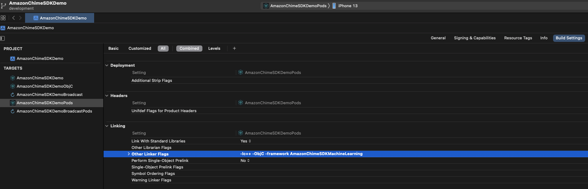

# Getting Started

## Prerequisites

* You have a basic to intermediate understanding of iOS development and tools.
* You have installed Xcode version 14.1 or later.

Note: Receiving traffic from the demo created in this post can incur AWS charges.

## Setup
### Add Amazon Chime SDK to your project
You can integrate Amazon Chime SDK in your project from either CocoaPods or binaries through Github release.

For the purpose of setup, your project's directory where your `*.xcodeproj` file is will be referred to as `root`.

1. The Amazon Chime SDK is available through [CocoaPods](http://cocoapods.org/). If you have not installed CocoaPods, install CocoaPods by running the command:
    ```
    gem install cocoapods
    pod setup
    ```

    Depending on your system settings, you may have to use sudo for installing cocoapods as follows:
    ```
    sudo gem install cocoapods
    pod setup
    ```

2. In the root directory (the directory where your `*.xcodeproj` file is), run the following to create a `Podfile` in your project:
    ```
    pod init
    ```

3. Edit the `Podfile` to include `AmazonChimeSDK-Bitcode` into your project if you need bitcode:
    ```
    target 'YourTarget' do
        pod 'AmazonChimeSDK-Bitcode', '0.23.0'
    end
    ```

    If you don't need bitcode, you can add `AmazonChimeSDK-No-Bitcode` instead:
    ```
    target 'YourTarget' do
        pod 'AmazonChimeSDK-No-Bitcode', '0.23.0'
    end
    ```

4. (Optional) If you want to use background blur and replacement features, add:
    ```
    target 'YourTarget' do
        pod 'AmazonChimeSDKMachineLearning-Bitcode', '0.2.0'
    end
    ```

    If you don't need bitcode, you can add `AmazonChimeSDKMachineLearning-No-Bitcode` instead:
    ```
    target 'YourTarget' do
        pod 'AmazonChimeSDKMachineLearning-No-Bitcode', '0.2.0'
    end
    ```

5. Then run the following command to install pods:
    ```
    pod install --repo-update
    ```

6. To open your project, open the newly generated `*.xcworkspace` file in the root directory using XCode. You can do this by running the following command in your root directory:
    ```
    xed .
    ```
    Note: Do *NOT* use *.xcodeproj to open project.

7. If you are using background blur and replacement features, under `Build Settings` tab, under the `Linking` section, add `-framework AmazonChimeSDKMachineLearning` to `Other Linker Flags`.

<p align="center">

</p>

### Microphone and camera permissions
1. Update `Info.plist` to include `Privacy - Microphone Usage Description` and `Privacy - Camera Usage Description`.
    Example value for `Privacy - Microphone Usage Description`:
    ```
    The app needs microphone permission for audio conferencing
    ```

    Example value for `Privacy - Camera Usage Description`:
    ```
    The app needs camera permission for video conferencing
    ```

2. Request microphone and camera permissions. You can use `AVAudioSession.recordPermission` and `AVCaptureDevice.authorizationStatus` by handling the response synchronously and falling back to requesting permissions. You can also use `requestRecordPermission` and `requestAccess` with an asynchronous completion handler. For example: 
```swift
    func requestRecordPermission(completion: @escaping (Bool) -> Void) {
        let audioSession = AVAudioSession.sharedInstance()
        switch audioSession.recordPermission {
        case .denied:
            completion(false)
        case .undetermined:
            audioSession.requestRecordPermission { granted in
                if granted {
                    completion(true)
                } else {
                    completion(false)
                }
            }
        case .granted:
            completion(true)
        @unknown default:
            completion(false)
        }
    }
```

```swift
    func requestVideoPermission(completion: @escaping (Bool) -> Void) {
        switch AVCaptureDevice.authorizationStatus(for: .video) {
        case .denied, .restricted:
            completion(false)
        case .notDetermined:
            AVCaptureDevice.requestAccess(for: .video) { authorized in
                if authorized {
                    completion(true)
                } else {
                    completion(false)
                }
            }
        case .authorized:
            completion(true)
        @unknown default:
            completion(false)
        }
    }
```

## Create a meeting session
You will need to create a [MeetingSession](https://github.com/aws/amazon-chime-sdk-ios/blob/master/AmazonChimeSDK/AmazonChimeSDK/session/MeetingSession.swift) to start a meeting. We provide [DefaultMeetingSession](https://github.com/aws/amazon-chime-sdk-ios/blob/master/AmazonChimeSDK/AmazonChimeSDK/session/DefaultMeetingSession.swift) as an implementation of the `MeetingSession` protocol.

1. Create a meeting and attendee
You will need to call [chime:CreateMeeting](https://docs.aws.amazon.com/chime/latest/APIReference/API_CreateMeeting.html) and [chime:CreateAttendee](https://docs.aws.amazon.com/chime/latest/APIReference/API_CreateAttendee.html). Your server application should make these API calls and securely pass the meeting and attendee responses to the client application. You will use this to configure the meeting session in the next step

For demo purposes, we provide a [serverless demo](https://github.com/aws/amazon-chime-sdk-js/blob/main/demos/serverless/README.md) that you can utilize to create a meeting and attendee. Note that deploying this serverless demo can incur AWS charges.

2. Create a meeting session configuration
Create a [MeetingSessionConfiguration](https://github.com/aws/amazon-chime-sdk-ios/blob/master/AmazonChimeSDK/AmazonChimeSDK/session/MeetingSessionConfiguration.swift). You can use the [CreateMeetingResponse](https://github.com/aws/amazon-chime-sdk-ios/blob/master/AmazonChimeSDK/AmazonChimeSDK/session/CreateMeetingResponse.swift) and [CreateAttendeeResponse](https://github.com/aws/amazon-chime-sdk-ios/blob/master/AmazonChimeSDK/AmazonChimeSDK/session/CreateAttendeeResponse.swift) created from the responses in the previous step. For example:

```swift
    let meetingResp = CreateMeetingResponse(meeting:
        Meeting(
            externalMeetingId: meeting.externalMeetingId,
            mediaPlacement: MediaPlacement(
                audioFallbackUrl: meeting.mediaPlacement.audioFallbackUrl ?? "",
                audioHostUrl: meeting.mediaPlacement.audioHostUrl,
                signalingUrl: meeting.mediaPlacement.signalingUrl,
                turnControlUrl: meeting.mediaPlacement.turnControlUrl ?? "",
                eventIngestionUrl: meeting.mediaPlacement.eventIngestionUrl
            ),
            mediaRegion: meeting.mediaRegion,
            meetingId: meeting.meetingId,
            primaryMeetingId: meeting.primaryMeetingId
        )
    )
```

```swift
    let attendeeResp = CreateAttendeeResponse(attendee:
        Attendee(
            attendeeId: attendee.attendeeId,
            externalUserId: attendee.externalUserId,
            joinToken: attendee.joinToken
        )
    )
```

```swift
    // Construct MeetingSessionConfiguration.
    let meetingSessionConfig = MeetingSessionConfiguration(
        createMeetingResponse: currentMeetingResponse,
        createAttendeeResponse: currentAttendeeResponse
    )
```

3. Create a [Logger](https://github.com/aws/amazon-chime-sdk-ios/blob/master/AmazonChimeSDK/AmazonChimeSDK/utils/logger/Logger.swift). We provide [ConsoleLogger](https://github.com/aws/amazon-chime-sdk-ios/blob/master/AmazonChimeSDK/AmazonChimeSDK/utils/logger/ConsoleLogger.swift) as an implementation of the `Logger` protocol. For example:

```swift
let logger = ConsoleLogger(name: "MeetingViewController")
```

4. Create an instance of `DefaultMeetingSession`.
```swift
let currentMeetingSession = DefaultMeetingSession(
    configuration: meetingSessionConfig,
    logger: logger
)
```

## Access AudioVideoFacade
Now that we have the meeting session, we can access its [AudioVideoFacade](https://github.com/aws/amazon-chime-sdk-ios/blob/master/AmazonChimeSDK/AmazonChimeSDK/audiovideo/AudioVideoFacade.swift) instance to control the audio and video experience.

To start the meeting, call `start`.
```swift
    do {
        // Start session
        try audioVideo.start()
    } catch PermissionError.audioPermissionError {
        // Handle permission error
    } catch {
        // Handle other errors
    }
```
Your application now starts sending and receiving audio. You can enable or disable sending local audio by calling the mute and unmute methods on the facade.

```swift
    // Mute local audio
    _ = audioVideo.realtimeLocalMute()

    // Unmute local audio
    _ = audioVideo.realtimeLocalUnmute()
```

While audio starts automatically, video does not. You can call the following methods to enable or disable sending local video and receiving remote video.

```swift
    // Start sending local video
    do {
        try audioVideo.startLocalVideo()
    } catch PermissionError.videoPermissionError {
        // Handle permission error
    } catch {
        // Handle other errors
    }

    // Stop sending local video
    audioVideo.stopLocalVideo()

    // Start receiving remote video
    audioVideo.startRemoteVideo()

    // Stop receiving remote video
    audioVideo.stopRemoteVideo()

    // Switch the camera for local video between front-facing camera and rear-facing camera
    audioVideo.switchCamera()
```

## Render a video tile
To render a [VideoTile](https://github.com/aws/amazon-chime-sdk-ios/blob/master/AmazonChimeSDK/AmazonChimeSDK/audiovideo/video/VideoTile.swift) (both local and remote), you will need to create a [DefaultVideoRenderView](https://github.com/aws/amazon-chime-sdk-ios/blob/master/AmazonChimeSDK/AmazonChimeSDK/audiovideo/video/DefaultVideoRenderView.swift).

By implementing `videoTileDidAdd` and `videoTileDidRemove` on the `VideoTileObserver`, you can track the currently active video tiles. The video tile can come from either video or content share.

```swift
    // Register the observer
    audioVideo.addVideoTileObserver(observer: self)
```

```swift
    func videoTileDidAdd(tileState: VideoTileState) {
        // Bind the video tile to the DefaultVideoRenderView
        audioVideo.bindVideoView(videoView: videoRenderView, tileId: tileState.tileId)
    }

    func videoTileDidRemove(tileState: VideoTileState) {
        // Unbind the video tile from the DefaultVideoRenderView
        audioVideo.unbindVideoView(tileId: tileState.tileId)
    }
```

## Cleanup

If you deployed the [serverless demo](https://github.com/aws/amazon-chime-sdk-js/blob/main/demos/serverless/README.md) but no longer want to keep the demo active in your AWS account, you can remove the demo resources to avoid incurring AWS charges. Delete the two [AWS CloudFormation](https://aws.amazon.com/cloudformation/) stacks created in the prerequisites that can be found in the [AWS CloudFormation console](https://console.aws.amazon.com/cloudformation/home).
